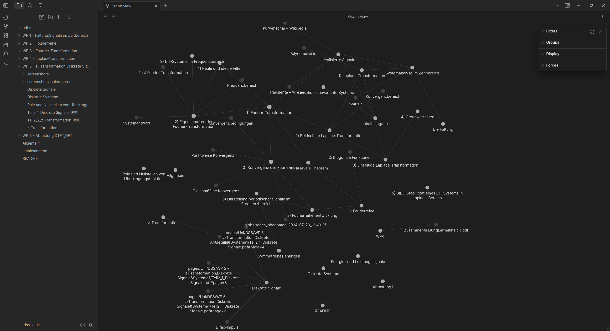
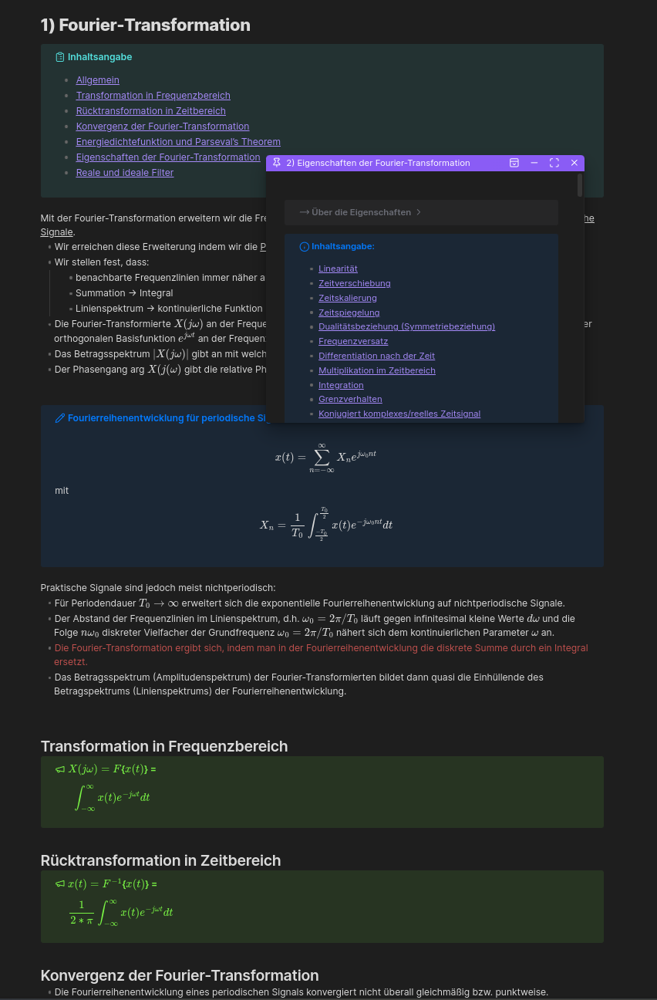
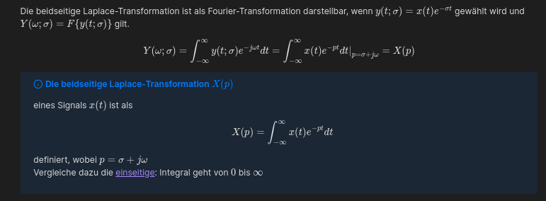

# DSS-Vault

## Description
Im Endeffekt ist das hier nur eine Übertragung der Vorlesungsfolien aus DSS, vom Wintersemester 23/24, an der TU Darmstadt bei Prof. Mario Pesavento und Prof. Anja Klein in ein hübsches Markdown-Format.
Spoiler: Ich nutze das in Obsidian, warum steht weiter unten.

### Warum?
Mich stört, dass es kein ordentliches Skript in DIN-A4 mit Fließtext zum lesen gibt. Auch fehlt eine ordentliche Inhaltsangabe, um schnell mal etwas nachschlagen zu können. 

Weil das Fach schon etwas trockene Mathematik ist, fand ich es während dem Semester super schwierig den **Überblick** zu behalten, was die einzelnen Kapitel eigentlich bedeuten und wo sie im Großen und Ganzen einzuordnen sind.
Die Parallelen der verschiedenen Transformationen sind hierbei zentral und ich muss mir, wenn ich an einem Thema arbeite, ständig in Erinnerung rufen, in welchem Zusammenhang das mit den anderen Kapiteln steht. Das hilft mir den Überblick und damit auch die Motivation zu behalten.

Alles in allem habe ich leider außerhalb des Hörsaals nicht wirklich was mit den Folien anfangen können, habe mich andauernd darin verlaufen und fand sie unübersichtlich.

### Markdown
Deshalb habe ich nach einer Möglichkeit gesucht, mir die Inhalte der Veranstaltung besser zu veranschaulichen. 
Voraussetzungen:
- Prinzipiell finde ich digitale Doku immer gut, einfach schon aus dem Grund weil sie mit `Ctrl+F` durchsuchbar ist. 
- Die angesprochen Überblick erleichtern Links inklusive Previews natürlich ungemein
- Markdown hat wahrscheinlich die einfachste Syntax, bei der das Ergebnis auch noch hübsch aussieht

Deshalb bin ich persönlich bisher auf [Obsidian](https://obsidian.md/) hängen geblieben. Es ermöglicht alle oben angesprochenen Punkte, wie jeder anständige Markdown-Editor. 
**Größter Nachteil:** Obsidian ist zwar kostenlos, aber **nicht Open Source**. 
**Warum trotzdem Obsidian?** 
1. Call-Outs sind extrem praktisch, sehen super aus und können customized werden
2. Die Community-Plugins ermöglichen echt coole Sachen, wie eine editing Toolbar, um nicht die komplette Markdown-Syntax auswendig können zu müssen, oder einen Hover-Editor um einstellen zu können was passiert, wenn man über eine Link hovert (kurze Vorschau, eigenes Fenster, etc..)
3. Graph view (siehe 1. screenshot)
4. Ist mMn. einfach hübsch

Beispiel Call-Out: (können auch eingeklappt werden)

- Ich habe in diesem Vault viele Call-Outs benutzt, weiß aber leider nicht, wie gut die in anderen Markdown-Editoren funktionieren. Das dürfte sich im Zweifel aber leicht fixen lassen.
## Installation
1. Markdown-Editor installieren
2. dieses Repo clonen/zip downloaden
3. in Obsidian auf "Open folder as vault" -> Repo auswählen
	- andere Editoren haben ähnliche Optionen
### Optional (Obsidian)
- unter Settings -> Community Plugins -> Turn on Community Plugins 
- completr: automatische Vorschläge für MathJax Syntax. Essentielles tool.
- editing toolbar: erzeugt eine toolbar mit allen üblichen Textbearbeitungsfunktionen (Fett, Kursiv, [...], Schriftfarbe, Tabelle, [...]) 
- hover editor, lässt preview Fenster (wenn mit der Maus drüber hovert) customisieren. Ich nutze dass um die Previews zu vergrößern, anzupinnen etc..

- Verschiedene Themes ausprobieren ;)

### Wordlist/Dictionary
Die standard Wortlisten decken leider die Fachbegriffe dieses (und aller anderen) Fachs nicht ab, daher werden bei angeschaltetem spell-check diese als falsch markiert. Die müssen dann händisch per Rechtsklick zum Dictionary hinzugefügt werden. 
#### Custom Wordlist importieren

## License
Wahrscheinlich die selbe wie die Vorlesungsfolien?

## Project status
Work in Progress. 
Stand jetzt (15.08.) hab ich vor die Klausur im September nachzuschreiben und würde dieses Vault vervollständigen.

## DSS

Prinzipiell ist das Fach gar nicht kompliziert. Es gibt relativ verständliche und interessante Zusammenhänge zwischen Mathematik und Physik aus Ingenieursperspektive. Die Mathematik ist allen Kapiteln ähnlich bis gleich.

DSS ist am End halt Kampfrechnen, da hilft auch keine schöne Doku, wenn die Therme nicht von fast alleine aus den Fingern purzeln.
